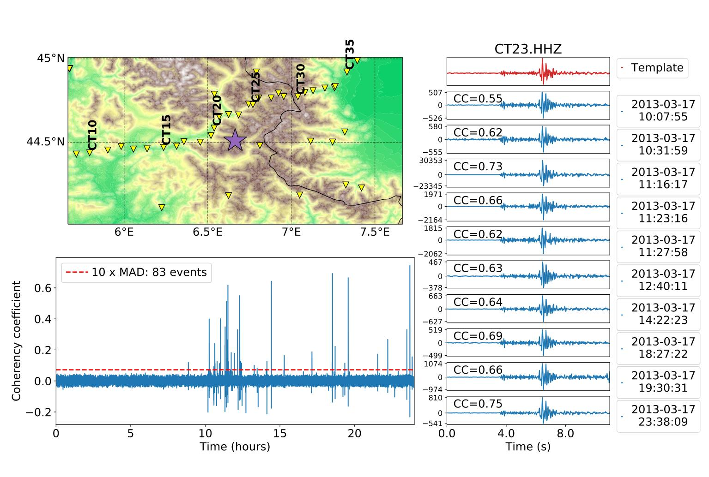

Example
=======

Description of the Arguments
----------------------------

The wrapper function :py:data:`matched_filter` takes 6 arguments (5 arguments only for the Matlab version):

* templates: array with the template waveforms to search for in the continuous data,
* moveouts: array with the relative arrival times (in samples) associated with each template,
* weights: array with the weights used in the weighted sum of the correlation coefficients,
* data: array with the continuous data,
* step: temporal step (in samples) between two consecutive calculations of the correlation coefficient,
* arch (Python only): architecture used to run FMF (:py:data:`'cpu'`, :py:data:`'precise'` or :py:data:`'gpu'`, default is :py:data:`'cpu'`),
* normalize (Python only): :py:data:`'short'` or :py:data:`'full'` normalization on the computation of the correlation coefficient.

Because Matlab and Python use different conventions for the mapping between the indexing and the location in memory, the input arrays have different dimensions depending on whether Matlab or Python is used.

Matlab
^^^^^^
In Matlab, the most contiguous dimension is the first one. Therefore, the arrays should have dimensions:

* continuous data (n_samples_data, n_components, n_stations)
* template waveforms (n_samples_template, n_components, n_stations, n_detections)
* moveouts (n_components, n_stations)
* weights (n_components, n_stations)

Python
^^^^^^
In Python, the most contiguous dimension is the last one. Therefore, the arrays should have dimensions:

* continuous data (n_stations, n_components, n_samples_data)
* template waveforms (n_detections, n_stations, n_components, n_samples_template)
* moveouts (n_stations, n_components)
* weights (n_stations, n_components)

Output of FMF
-------------

FMF returns the time series of the average correlation coefficients (CC) calculated for each template given in input. Therefore, the output has dimensions:

* Python: (n_templates, n_correlations),
* Matlab: (n_correlations, n_templates).

The number of correlations (n_correlations) is determined by the length of the continuous data and the temporal step you used.

Given the 6 input arguments described here, the correlation coefficients are obtained by calling the wrapper function in the following way: 

.. code-block:: matlab 

    cc = fast_matched_filter(templates, moveouts, weights, data, step)

:py:data:`cc(:, i)` is the correlation coefficient time series for the i-th template.

.. code-block:: python

     cc = matched_filter(templates, moveouts, weights, data, step, arch='cpu' or 'gpu')

:py:data:`cc[i,:]` is the correlation coefficient time series for the (i+1)-th template.

To perform earthquake detection from the CC time series, we typically look for the samples that exceed a threshold defined by 8xRMS or 10xMAD (see figure below).

| Figure from:
| Beaucé, Eric, W. B. Frank, and Alexey Romanenko (2017). Fast matched-filter (FMF): an efficient seismic matched-filter search for both CPU and GPU architectures.  
| *Seismological Research Letters*, doi: `10.1785/022017018 <https://doi.org/10.1785/0220170181>`_

